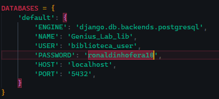

# DESAFIO TÉCNICO - ESTÁGIO PYTHON/DJANGO

## Descrição do Sistema

---

##### *O Sistema de Controle de Biblioteca para a Genius Labrepresenta uma inovação significativa no gerenciamento debibliotecas educacionais. Com uma interface amigável efuncionalidades robustas, a plataforma digitaliza e simplificaprocessos que tradicionalmente consomem tempo e recursos.Administradores têm à disposição ferramentas avançadas paracatalogar novos livros, acompanhar o status dos empréstimos egerar relatórios que oferecem insights sobre a circulação dosmateriais. Isso não só melhora a eficiência operacional, mastambém permite decisões informadas para a expansão doacervo. Por outro lado, os usuários desfrutam de umaexperiência otimizada, com acesso rápido a informações sobredisponibilidade de livros e um histórico de empréstimos quefacilita a gestão pessoal de suas leituras. Essa solução nãoapenas melhora o acesso aos recursos educacionais, mastambém promove um ambiente de aprendizagem maisorganizado e eficiente.*

---

## o arquivo requirementes foi gerado usando : 
    pip freeze > requirements.txt

*para rodar o projeto baixe todos os requirimentos do sistemas com :*

    pip install -r requirements.txt

*em seguida digite*

    python manage.py runserver

---

## assim está estruturado o sistema :

    biblioteca_genius_lab/
        ├── biblioteca_genius_lab/          # Diretório do projeto Django
        │   ├── __init__.py
        │   ├── settings.py
        │   ├── urls.py
        │   └── wsgi.py
        ├── emprestimos/                    # Aplicação para gerenciar empréstimos
        │   ├── __init__.py
        │   ├── admin.py
        │   ├── apps.py
        │   ├── models.py
        │   ├── views.py
        │   ├── urls.py
        │   ├── forms.py
        │   └── templates/
        │       └── emprestimos/
        │           ├── registro_emprestimo.html
        │           ├── devolucao_emprestimo.html
        │           └── relatorio.html
        ├── livros/                         # Aplicação para gerenciar livros
        │   ├── __init__.py
        │   ├── admin.py
        │   ├── apps.py
        │   ├── models.py
        │   ├── views.py
        │   ├── urls.py
        │   ├── forms.py
        │   └── templates/
        │       └── livros/
        │           └── cadastro_livro.html
        ├── usuarios/                       # Aplicação para gerenciar usuários
        │   ├── __init__.py
        │   ├── admin.py
        │   ├── apps.py
        │   ├── models.py
        │   ├── views.py
        │   ├── urls.py
        │   ├── forms.py
        │   └── templates/
        │       └── usuarios/
        │           └── cadastro_usuario.html
        ├── templates/                      # Templates globais
        │   ├── base.html
        │   └── index.html
        ├── static/                         # Arquivos estáticos (CSS, JS)
        │   ├── css/
        │   │   └── styles.css
        │   └── js/
        │       └── scripts.js
        ├── manage.py
        └── requirements.txt

### passo a passo até chegarmos na estrutura do projeto e como o projeto foi construido:

#### inicializando a pasta com estrutura django para biblioteca_genius_lab

    django-admin startproject biblioteca_genius_lab
---

*NAO ESQUECER -> Sempre que  criar ou modificar modelos em suas aplicações, é necessário criar novas migrações e aplicá-las*

        python manage.py makemigrations
        python manage.py migrate
---

#### testar a inicialização (antes que comece a dar erro) (lembrar de estar no repo correto) 

    python manage.py runserver

### Após criado a pasta principal com o modelo django foram criados as pastas separadas mas para cada entidade, no caso usuarios, livros e emprestimos. O passo é o mesmo do anterior, é só jogar os comandos no terminal que os arquivos sao gerados no formato django bem bonitinho 

    python manage.py startapp usuarios
    python manage.py startapp livros
    python manage.py startapp emprestimos

#### neste momento a estrutura fica assim
    biblioteca/
    ├── biblioteca_genius_lab/
    ├── emprestimos/
    ├── livros/
    ├── usuarios/
    ├── manage.py

*lembrar de adicionar as aplicações na lista  de apps instalados*

    deve ficar em biblioteca_genius_lab\biblioteca_genius_lab\settings.py

##### *foi decidido que este seria um bom momento para configurar o banco de dados, nosso projeto tinha como requisito utilizar o postgreSQL então faremos desta forma*

###### dentro do Postgresql, acessamos o prompt  com :
    sudo -u postgres psql

###### e usamos os comandos sql  (sql shell) para criar o nosso banco de dados de fato (e usuario admin)

    CREATE DATABASE Genius_Lab_lib;
    CREATE USER biblioteca_user WITH PASSWORD  (neste caso usarei o padrao "postgres") 'a_senha_que_escolheu'; (ronaldinho_gaucho@10)
    GRANT ALL PRIVILEGES ON DATABASE Genius_Lab_lib TO biblioteca_user;

##### *Lembrar do conector do postgre*

    pip install psycopg2-binary

#### por padrão o django trabalha com o sqlite então mudamos para o postgres lá no data base novamente.

*os dados devem ser os mesmo dos adicionados lá no terminal do sql (sql shell)*

##### agora basta executar as migracões 

    python manage.py migrate

#### agora os modelos deverao ser criados, de comeco, os usuários.Sempre usando POO

#### na etapa testes sempre utilizo estes passos:

*Ativar o Ambiente Virtual:*

No PowerShell:

    .\venv\Scripts\Activate.ps1

*Instalar as Dependências (se necessário):*

    pip install -r requirements.txt

*executar as Migrações:*

    python manage.py makemigrations
    python manage.py migrate

*Criar um Superusuário (se ainda não tiver):*

    python manage.py createsuperuser

*Executar o Servidor:*

    python manage.py runserver

*Interface Administrativa: http://127.0.0.1:8000/admin/*
*Aplicação Principal: http://127.0.0.1:8000/*
